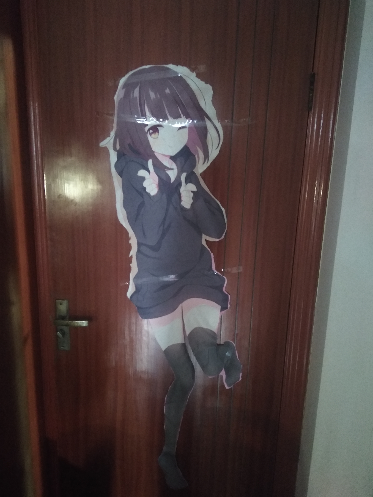

# otaku_things
二次元的小心思

这里有个家伙不务正业用blender做演示视频（我之前还拿blender做ps图层原理的展示哈哈哈，别人是拿来做动画，而我做这些演示视频）

just for beautiful thins.
like cute girls,so cosplay is just make it true.
管他那么多，我也是想了好久想出来的廉价办法，就上传上来了。
## 低成本实现等身人偶手办的版本
方法一：先买一个等身二次元抱枕的枕套，再买很多棉花，把人物剪下来，

然后缝合，并用棉花填充

方法二：把棉花填充到长筒袜和各种衣服中，然后把人物贴到上面让她立体起来

## 女装连体fake boob的制作方法（廉价）

<video id="video" controls="true" preload="none" poster="封面">
      <source id="mp4" src="mp4格式视频" type="video/mp4">
</videos>
